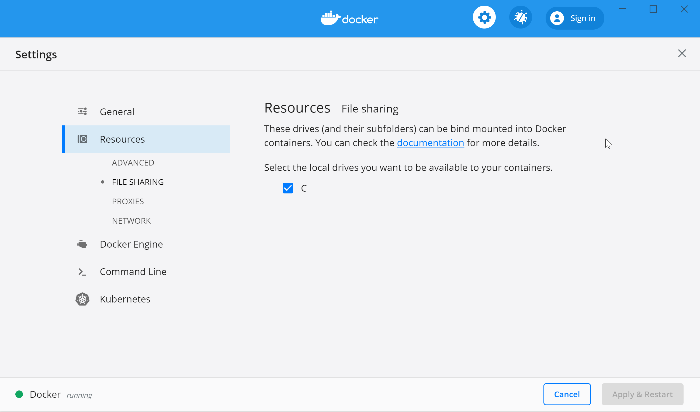

# radiance-docker

A Dockerfile to build NREL/Radiance for use on Windows

This provides you with a simple command (`radiance.cmd`) that will drop you into a bash shell running on an ubuntu image that has Radiance pre-compiled. The current working directory is mapped to `/wd` and that is where the shell is opened.

## Why

It turns out, building Radiance on Windows is not really straightforward. Unless you have Cygwin. And know how to compile programs. And can stomache a bunch of error messages. And have the whole compilation toolchain all set up etc. I think I might be able to get this going, but I needed a quick solution for a friend and I believe this is it.

The commands I'm interested in providing are these two in particular:

- `pabopto2bsdf`

- `bsdf2klems`

As they are not provided by the standard Windows install of Radiance - use that for the rest of the commands.

## Getting started

- First, you'll need to install Docker if you haven't already:
  
  - [Download and install Docker Desktop](https://www.docker.com/products/docker-desktop)

- Make sure the `radiance.cmd` file in this repo are in your `PATH` variables 
  
  - `SET PATH=C:\Path\To\Your\Copy\of\this\Repo;%PATH%`
  
  - or permanently using the ["Edit the system environment variables"](https://www.techjunkie.com/environment-variables-windows-10/) control panel thingy by searching in the start menu
  
  - (the `docker` command should also be in your PATH)

- Make sure Docker can mount your current working directory
  
  - see hints here: [Mounting Host Directories](https://rominirani.com/docker-on-windows-mounting-host-directories-d96f3f056a2c)
  
  - 

- For the following commands, I assume you're in the command shell (e.g. `cmd.exe`) 
  
  - `docker pull darenthomas/radiance`
  
  - (the above command downloads the image containing the Radiance build I made - the `.cmd` files in this repository assume you have an image with the tag "darenthomas/radiance")

- Next, navigate to the folder with your input files (using `cd` inside a `cmd.exe` shell) and type `radiance.cmd`. This should look something like this:

- 

```bash
Microsoft Windows [Version 10.0.18362.720]
(c) 2019 Microsoft Corporation. All rights reserved.

C:\Users\darthoma>cd Downloads

C:\Users\darthoma\Downloads>set PATH=%PATH%;C:\Users\darthoma\Documents\GitHub\radiance-docker

C:\Users\darthoma\Downloads>radiance.cmd

C:\Users\darthoma\Downloads>docker run -it --rm -v C:\Users\darthoma\Downloads:/wd --workdir /wd darenthomas/radiance bash
root@df739f44261a:/wd# ls *.dat
meas1.dat  meas2.dat
root@df739f44261a:/wd# pabopto2bsdf meas1.dat meas2.dat > bsdf.sir
root@df739f44261a:/wd# head bsdf.sir
#?RADIANCE
pabopto2bsdf meas1.dat meas2.dat
CAPDATE= 2020:04:09 10:27:07
GMT= 2020:04:09 10:27:07
NAME=ETHZ001
SYMMETRY=0
IO_SIDES= 1 1
COLORIMETRY=Unknown
GRIDRES=256
BSDFMIN=0.00113666
root@df739f44261a:/wd#
```

- Note, in the listing above, the commands you enter are
  
  - `radiance.cmd` - start the docker shell
  
  - `pabopto2bsdf meas1.dat meas2.dat > bsdf.sir`
  
  - the other commands used are:
    
    - `cd` (change directory)
    
    - `set` (setting environment variables)
    
    - `ls` (inside the `bash` environment this lists files)
    
    - `head` (show top 10 lines of a file)
    
    - using these commands are out of scope of this documentation, but the internet is a wonderful place and can explain it all. Try googling an intro to using the shell on linux for some help getting started.

## Building the docker image

You won't actually have to build this yourself, as I will be publishing the image to [Docker Hub](https://hub.docker.com/). So this is more of a reminder to myself

```
docker build -t darenthomas/radiance .
```
